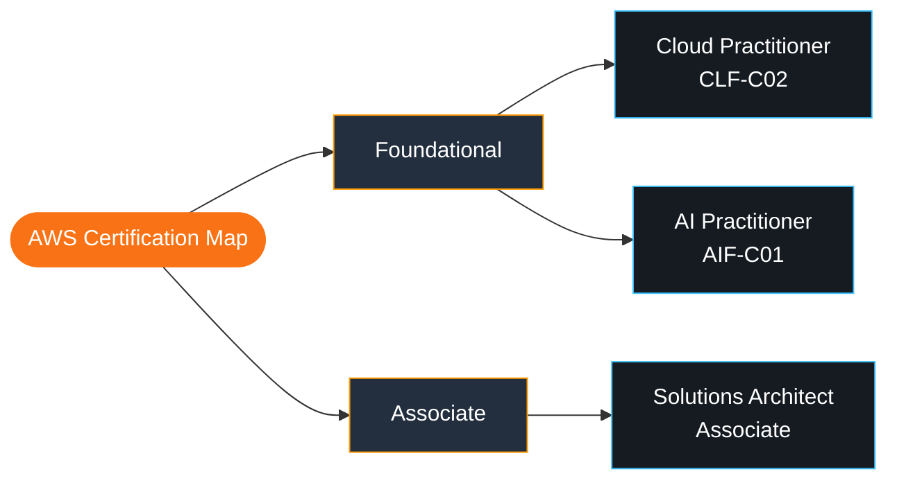
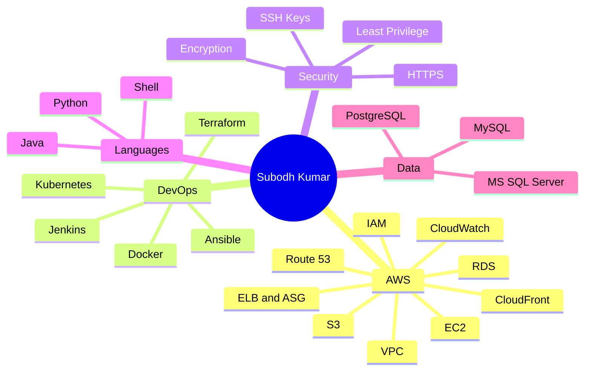
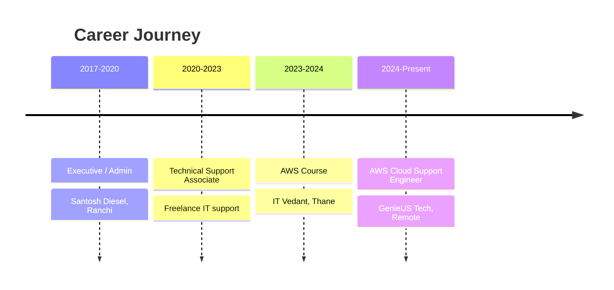

<!-- ═══════════════ HEADER ═══════════════ -->
<div align="center">


<a href="https://github.com/SubodhK143">
  
</a>

<br/>


[](https://linkedin.com/in/subodh-kumar-aws-certified)
[](https://credly.com/users/subodh-kumar.72ee6a45)
[](mailto:subodhawscertified@gmail.com)

</div>

---

## 👨‍💻 About Me

> **Unique touch:** a live terminal that "types" my intro

<div align="center">
  
</div>

```yaml
name:        Subodh Kumar
role:        AWS Cloud Support Engineer
experience:  2+ years in AWS Cloud Support
location:    Pune, Maharashtra, India 🇮🇳
focus:       [AWS Infrastructure, Automation, Cost Optimization]
currently:   Deepening Terraform, Docker, Jenkins & Kubernetes
passionate:  Performance optimization, security & reliable deployments
```

- ☁️ I troubleshoot and manage AWS services: **EC2, IAM, S3, RDS, CloudWatch, CloudFront, Route 53**
- 🏗️ I design **highly available, scalable** architectures
- ⚙️ I automate infrastructure with **Terraform** and server configuration with **Ansible**
- 🔐 I care about **least-privilege access**, encryption and secure-by-default setups

---

## 🏅 Certifications

> **Unique touch:** my AWS certification map (rendered live by GitHub)



<div align="center">

[](https://credly.com/users/subodh-kumar.72ee6a45)
[](https://credly.com/users/subodh-kumar.72ee6a45)
[](https://credly.com/users/subodh-kumar.72ee6a45)

</div>

---

## 🛠️ Tech Stack

> **Unique touch:** an interactive-style skill mind map



<div align="center">


<br/>


</div>

<details open>
<summary><b>☁️ Cloud (AWS)</b></summary>
<br/>

`EC2` `S3` `IAM` `VPC` `RDS` `CloudWatch` `CloudFront` `Route 53` `ELB` `Auto Scaling` `OAC` `Amplify` `Billing & Cost Optimization` `High Availability`

</details>

<details open>
<summary><b>⚙️ DevOps & Automation</b></summary>
<br/>

| Area | Tools |
|------|-------|
| Infrastructure as Code | Terraform (Modules, Remote State, Variables, Outputs) |
| Configuration Management | Ansible (Playbooks, Nginx deployment, service management) |
| Containers & Orchestration | Docker, Kubernetes |
| CI/CD | Jenkins, Deployment Automation |
| Version Control | Git, GitHub, GitLab |

</details>

<details>
<summary><b>🔐 Security, Networking & Monitoring</b></summary>
<br/>

- **Security:** IAM Roles & Policies, Least-Privilege Access, RBAC, Encryption Settings, SSH Key-Based Auth, HTTPS (SSL/TLS)
- **Networking:** VPC Components, Security Groups, Load Balancing, DNS (Route 53)
- **Monitoring:** CloudWatch metrics, alarms, proactive monitoring and escalation

</details>

<details>
<summary><b>💾 Databases, OS & Scripting</b></summary>
<br/>

- **Databases:** MS SQL Server, PostgreSQL, MySQL, T-SQL, PL/SQL, Stored Procedures, Query Optimization, Backup & Recovery
- **OS:** Linux (EC2 management, User Data, basic automation), Windows
- **Scripting:** Python, Java, Shell Scripting

</details>

---

## 🚀 Featured Projects

> **Unique touch:** an animated request-flow diagram of my 3-tier AWS build

<div align="center">
  
</div>

| Project | Tech | Highlights |
|---------|------|------------|
| **🏢 [3-Tier Web Application on AWS](https://github.com/SubodhK143/Three-Tier-App-On-AWS)** | `EC2` `RDS` `ELB` `Auto Scaling` `S3` | Frontend/backend on EC2 with RDS database; improved modularity and fault isolation by **60%**; automated S3→EC2 file transfer cut manual overhead by **40%** |
| **🌐 Static Website on S3 + CloudFront** | `S3` `CloudFront` `OAC` `HTTPS` | Private S3 bucket served via global CDN; HTTPS (SSL/TLS) and Origin Access Control block direct public access |
| **🧱 Terraform & Ansible Provisioning** | `Terraform` `Ansible` `EC2` `VPC` `Nginx` `Git` | Reusable Terraform modules for EC2, Security Groups and VPC; Ansible playbooks automate Nginx deployment; SSH key-based auth |

---

## 📚 All Repositories

> **Unique touch:** live repo cards, grouped by topic, plus a table that refreshes itself every day (see `update-repos.yml`)

### ☁️ AWS & Cloud

<table>
<tr>
<td><a href="https://github.com/SubodhK143/Three-Tier-App-On-AWS"></a></td>
<td><a href="https://github.com/SubodhK143/Serverless-Real-Time-Chat-Application-With-Global-Distribution"></a></td>
</tr>
<tr>
<td><a href="https://github.com/SubodhK143/AWS-S3-Weather-App"></a></td>
<td><a href="https://github.com/SubodhK143/KodeKloud-AWS-Day-47-Integrating-AWS-SQS-and-SNS-for-Reliable-Messaging"></a></td>
</tr>
</table>

### 🐧 DevOps & Web Servers

<table>
<tr>
<td><a href="https://github.com/SubodhK143/DevOps-Notes-By-SK"></a></td>
<td><a href="https://github.com/SubodhK143/Nginx-HTML-Files"></a></td>
</tr>
</table>

### 🐍 Python & Practice Tasks

<table>
<tr>
<td><a href="https://github.com/SubodhK143/CODSOFT_TASK1"></a></td>
<td><a href="https://github.com/SubodhK143/CODSOFT_TASK2"></a></td>
</tr>
<tr>
<td><a href="https://github.com/SubodhK143/CODSOFT_TASK5"></a></td>
<td><a href="https://github.com/SubodhK143/itvedant-demo"></a></td>
</tr>
</table>

### 🔄 Auto-Updating Repository Table

<!--REPOS:START-->
| Repository | Description | Language | ⭐ |
|------------|-------------|----------|----|
| [DevOps-Notes-By-SK](https://github.com/SubodhK143/DevOps-Notes-By-SK) | | | 0 |
| [Serverless-Real-Time-Chat-Application-With-Global-Distribution](https://github.com/SubodhK143/Serverless-Real-Time-Chat-Application-With-Global-Distribution) | | CSS | 0 |
| [AWS-S3-Weather-App](https://github.com/SubodhK143/AWS-S3-Weather-App) | | CSS | 0 |
| [CODSOFT_TASK5](https://github.com/SubodhK143/CODSOFT_TASK5) | | Python | 0 |
| [CODSOFT_TASK2](https://github.com/SubodhK143/CODSOFT_TASK2) | | Python | 0 |
| [CODSOFT_TASK1](https://github.com/SubodhK143/CODSOFT_TASK1) | | Python | 0 |
| [Nginx-HTML-Files](https://github.com/SubodhK143/Nginx-HTML-Files) | | HTML | 0 |
| [KodeKloud-AWS-Day-47-Integrating-AWS-SQS-and-SNS-for-Reliable-Messaging](https://github.com/SubodhK143/KodeKloud-AWS-Day-47-Integrating-AWS-SQS-and-SNS-for-Reliable-Messaging) | | | 0 |
| [Three-Tier-App-On-AWS](https://github.com/SubodhK143/Three-Tier-App-On-AWS) | This is my first Git Repository. | JavaScript | 0 |
| [itvedant-demo](https://github.com/SubodhK143/itvedant-demo) | This is my first Git Repository. | | 0 |
<!--REPOS:END-->

---

## 💼 Experience

> **Unique touch:** my career as a live timeline



**What I do day to day**
- Troubleshoot EC2, IAM permission and S3 access issues
- Set up CloudWatch alarms for proactive monitoring and escalation
- Host and secure static sites with S3, CloudFront and Route 53
- Support RDS connectivity and performance monitoring
- Apply IAM least-privilege policies and manage encryption settings

---

## 📊 GitHub Stats

> **Unique touch:** a rotating dev quote plus the full stats wall

<div align="center">


<br/><br/>


<br/>


<br/>


</div>

### 📈 Contribution Graph

<div align="center">


</div>

### 🐍 Contribution Snake

<div align="center">


</div>

---

## 🎯 Currently

> **Unique touch:** my DevOps loop, animated, with a live learning checklist

<div align="center">
  
</div>

- [x] AWS core services (EC2, S3, IAM, VPC, RDS, CloudWatch)
- [x] Infrastructure as Code with Terraform and Ansible
- [ ] Docker and Kubernetes in more depth
- [ ] Jenkins CI/CD pipelines end to end
- [ ] AWS cost optimization patterns
- 🤝 Open to collaborating on **AWS / DevOps** projects

---

## 📫 Let's Connect

<div align="center">

| Platform | Link |
|----------|------|
| 📧 Email | [subodhawscertified@gmail.com](mailto:subodhawscertified@gmail.com) |
| 💼 LinkedIn | [subodh-kumar-aws-certified](https://linkedin.com/in/subodh-kumar-aws-certified) |
| 🎖️ Credly | [subodh-kumar.72ee6a45](https://credly.com/users/subodh-kumar.72ee6a45) |
| 🐙 GitHub | [SubodhK143](https://github.com/SubodhK143) |

<br/>


</div>


